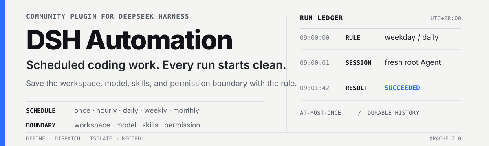

<p align="center">
  
</p>

<div align="center">

  **Schedule standalone coding work from the Web UI or any DSH conversation.**

  [简体中文](README.zh-CN.md) · [Documentation](docs/00-交接入口/00-阅读导航.md) · [Apache-2.0](LICENSE)

  [](https://www.npmjs.com/package/@michengai/dsh-automation)
  [](https://www.npmjs.com/package/@michengai/dsh-automation)
  [](LICENSE)
</div>

> DSH Automation is a community-maintained DeepSeek Harness plugin, not an official DeepSeek AI product.

DSH Automation adds a durable scheduler to DeepSeek Harness. A rule saves the task prompt, schedule, workspace, model, skills, and Host permission preset. When it is due, the plugin starts a fresh root Agent and Session instead of inheriting the source conversation.

## See it in action

Create, search, pause, run, and inspect scheduled rules from **Settings → Scheduled Tasks**:


- **Flexible schedules** — once, interval, hourly, daily, weekly, monthly, or every N days.
- **Clean execution** — every occurrence gets its own root Agent and Session.
- **Host-native controls** — use the Host workspace, model, skills, permission presets, and approval UI.
- **Durable history** — keep `queued`, `running`, `succeeded`, `failed`, `skipped`, and `cancelled` results.

<details>
<summary><strong>See the complete chat-to-schedule flow</strong></summary>

Describe the job in a conversation:


When the session policy requires approval, DSH shows its official approval card:


After approval, the saved rule is summarized in the conversation:


</details>

## Install

### From npm

Prerequisites:

- A working DeepSeek Harness Web installation with `dsh` available in PowerShell.
- A target DSH profile. The examples below use `web`.

```powershell
[Console]::OutputEncoding = [System.Text.Encoding]::UTF8
$OutputEncoding = [System.Text.Encoding]::UTF8
dsh plugin --profile web add @michengai/dsh-automation@latest --registry=https://registry.npmjs.org/
dsh --profile web --dump-config
```

Restart DSH Web, then hard-refresh the browser. To pin a release, replace `@latest` with a concrete version such as `@x.y.z`.

> `dsh plugin add` forwards to `pnpm add` in the profile directory. Explicitly using `@latest` and the npm registry avoids stale local mirrors.

<details>
<summary><strong>Install from source</strong></summary>

Source installation and development require Node.js `22.19.x` or `24+`.

```powershell
[Console]::OutputEncoding = [System.Text.Encoding]::UTF8
$OutputEncoding = [System.Text.Encoding]::UTF8
Set-Location D:\Repository\deepseek-harness-plugin
git clone https://github.com/MichengAI/dsh-automation.git
Set-Location .\dsh-automation
pnpm install
pnpm check
dsh plugin --profile web add .
dsh --profile web --dump-config
```

Restart DSH Web and hard-refresh the browser. Local installation applies `cordis.patch.yml`; do not copy files from `lib` manually.

</details>

## How it works

1. **Define intent** in Settings or describe the schedule in a conversation.
2. **Confirm the boundary** using the Host model, skills, workspace, permission preset, and approval flow.
3. **Dispatch once** when the rule is due. One rule can have at most one active run.
4. **Start clean** in a fresh root Agent and Session with the saved prompt and configuration.
5. **Record the outcome** in durable history without automatically retrying a started run.

Scheduled runs appear in the workspace **Scheduled** tab. Folders are rule names; child sessions are individual run times:


## Use

| Goal | Action | Scope |
| --- | --- | --- |
| Create a rule | Select **New scheduled task**, then set the name, schedule, prompt, workspace, model, skills, and permission. | Host-wide |
| Create from chat | Describe the schedule in any conversation, or select **Create in chat**. | Current conversation |
| Pause or resume | Use the switch on a task card. | One rule |
| Run now | Open the task menu and select **Run now**. | One rule |
| Delete | Open the task menu and select **Delete task**. Existing run history is retained. | Definition only |
| Inspect runs | Open **Run history**, then filter by date, task, or status. | Host-wide |

Run history remains available in Settings:


## Safety boundary

A schedule stores future intent; it is not a cached permission grant.

| Item | Behavior |
| --- | --- |
| Permission | Options and the default come from the Host `permissionPresets` service, including custom presets. |
| Full access | `danger-full-access` uses the same risk confirmation and orange warning as Chat. |
| Approval | Chat creation follows the session policy. Full access (`never`) proceeds; Workspace Write / Read Only (`ask`) uses the official card. Unattended runs remain fail-closed `never`. |
| Retry | A started run is not automatically retried. |
| Host restart | Leftover `queued` or `running` records become `failed(host_interrupted)`. |
| Overlap | A rule has at most one active run. A colliding occurrence becomes `skipped(overlap)`. |

## DSH ecosystem

DSH Automation can be installed independently or through the desktop and Web suites. All options share the same DSH core; on stock DSH, this plugin does not depend on Codex UI.

| Product | Relationship |
| --- | --- |
| [DeepSeek Harness](https://github.com/deepseek-ai/deepseek-harness) | Host runtime for models, sessions, tools, and plugins |
| [DSH Codex Desktop](https://github.com/MichengAI/dsh-codex-desktop) | Ready-to-install desktop product with all six feature products built in |
| [DSH Codex Suite](https://github.com/MichengAI/dsh-codex-ui/tree/main/packages/dsh-codex-suite) | One-click suite for an existing DSH Web environment |
| Feature products | [Codex UI](https://github.com/MichengAI/dsh-codex-ui) · [IM Connect](https://github.com/MichengAI/dsh-im-connect) · **Automation** · [Skills Manager](https://github.com/MichengAI/dsh-skills-manager) · [Archive Manager](https://github.com/MichengAI/dsh-archive-manager) · [Agency Agents](https://github.com/MichengAI/dsh-agency-agents) |

## Development

Source files live in `src`; builds are written to `lib`:

- [`src/index.ts`](src/index.ts) — Host plugin, Agent tools, and RPC.
- [`src/service.ts`](src/service.ts) — durable definitions, scheduler clock, and run admission.
- [`src/client/index.ts`](src/client/index.ts) — Settings UI and chat prefill.
- `tests/*.test.ts` — domain, recurrence, service, client, and package-contract tests.

```powershell
pnpm check
```

`pnpm check` runs type checking, tests, and the production build. Changes to execution code must preserve at-most-once dispatch, Agent-tool workspace scoping, and fail-closed unattended approval.

## Documentation and license

Start with the [documentation entry](docs/00-交接入口/00-阅读导航.md) for project status, architecture, boundaries, and iteration notes. Additional product notices are in [NOTICE](NOTICE).

Licensed under the [Apache License 2.0](LICENSE).
