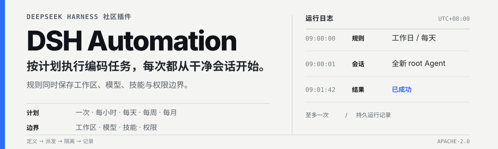

<p align="center">
  
</p>

<div align="center">

  **从 Web 设置页或任意 DSH 对话安排独立编码任务。**

  [English](README.md) · [项目文档](docs/00-交接入口/00-阅读导航.md) · [Apache-2.0](LICENSE)

  [](https://www.npmjs.com/package/@michengai/dsh-automation)
  [](https://www.npmjs.com/package/@michengai/dsh-automation)
  [](LICENSE)
</div>

> DSH Automation 是社区维护的 DeepSeek Harness 插件，并非 DeepSeek AI 官方产品。

DSH Automation 为 DeepSeek Harness 增加持久化任务调度。每条规则会保存任务说明、计划、工作区、模型、技能和 Host 权限预设；到期时，插件启动全新的 root Agent 和 Session，不继承来源对话。

## 看看它如何工作

在**设置 → 定时任务**中创建、搜索、暂停、立即运行和检查计划规则：


- **灵活计划**：支持一次、间隔、每小时、每天、每周、每月或每 N 天。
- **独立执行**：每次到期都使用自己的 root Agent 和 Session。
- **Host 原生控制**：沿用 Host 的工作区、模型、技能、权限预设和授权界面。
- **持久记录**：保留 `queued`、`running`、`succeeded`、`failed`、`skipped`、`cancelled` 结果。

<details>
<summary><strong>查看完整的“对话创建 → 保存规则”流程</strong></summary>

先在对话里描述任务：


当前会话策略要求审批时，DSH 会显示官方授权卡：


确认后，保存的规则会在对话里汇总：


</details>

## 安装

### 从 npm 安装

前置条件：

- 已可正常运行 DeepSeek Harness Web，并可在 PowerShell 中使用 `dsh`。
- 已确定目标 DSH profile；以下示例使用 `web`。

```powershell
[Console]::OutputEncoding = [System.Text.Encoding]::UTF8
$OutputEncoding = [System.Text.Encoding]::UTF8
dsh plugin --profile web add @michengai/dsh-automation@latest --registry=https://registry.npmjs.org/
dsh --profile web --dump-config
```

重启 DSH Web，然后在浏览器硬刷新。需要固定版本时，把 `@latest` 换成具体版本，例如 `@x.y.z`。

> `dsh plugin add` 会转发到 profile 目录中的 `pnpm add`。显式使用 `@latest` 和 npm 官方源可避免本地镜像停留在旧版。

<details>
<summary><strong>从源码安装</strong></summary>

源码安装和二次开发需要 Node.js `22.19.x` 或 `24+`。

```powershell
[Console]::OutputEncoding = [System.Text.Encoding]::UTF8
$OutputEncoding = [System.Text.Encoding]::UTF8
Set-Location D:\Repository\deepseek-harness-plugin
git clone https://github.com/MichengAI/dsh-automation.git
Set-Location .\dsh-automation
pnpm install
pnpm check
dsh plugin --profile web add .
dsh --profile web --dump-config
```

重启 DSH Web 并硬刷新浏览器。本地安装会应用 `cordis.patch.yml`；不要手工复制 `lib` 文件。

</details>

## 执行流程

1. **定义意图**：在设置页填写规则，或在对话里描述计划。
2. **确认边界**：使用 Host 模型、技能、工作区、权限预设和授权流程。
3. **到期派发**：同一规则同时最多存在一个 active run。
4. **独立开始**：使用保存的任务说明和配置，启动全新 root Agent 和 Session。
5. **记录结果**：把结果写入持久历史；已经开始的运行不会自动重试。

计划运行会出现在工作区的**定时**页签中。文件夹是规则名称，子会话是每次运行时间：


## 使用

| 目标 | 操作 | 范围 |
| --- | --- | --- |
| 创建规则 | 点击**新建定时任务**，填写名称、计划、任务说明、工作区、模型、技能和权限。 | 当前 Host |
| 通过对话创建 | 在任意对话描述计划，或点击**通过对话创建**。 | 当前对话 |
| 暂停或恢复 | 使用任务卡片上的开关。 | 单条规则 |
| 立即运行 | 打开任务菜单，选择**立即执行**。 | 单条规则 |
| 删除 | 打开任务菜单，选择**删除任务**；已有运行记录会保留。 | 仅规则定义 |
| 查看记录 | 打开**执行记录**，再按日期、任务或状态筛选。 | 当前 Host |

运行记录会持续保留在设置页中：


## 权限与安全边界

计划保存的是未来意图，不是缓存下来的授权。

| 项目 | 行为 |
| --- | --- |
| 权限 | 列表和默认值来自 Host `permissionPresets` 服务，包括自定义预设。 |
| 完全访问 | `danger-full-access` 使用与 Chat 相同的风险确认和橙色提示。 |
| 审批 | 对话创建跟随当前会话策略。Full access（`never`）直接创建；Workspace Write / Read Only（`ask`）使用官方授权卡。无人值守运行仍是 fail-closed 的 `never`。 |
| 重试 | 已经开始的运行不会自动重试。 |
| Host 重启 | 遗留的 `queued` 或 `running` 记录变成 `failed(host_interrupted)`。 |
| 重叠 | 同一规则同时最多一个 active run；冲突 occurrence 记为 `skipped(overlap)`。 |

## DSH 产品生态

DSH Automation 可独立安装，也可随桌面端或 Web 套件使用。它们共享同一个 DSH 核心；在原生 DSH 中，本插件不依赖 Codex UI。

| 产品 | 关系 |
| --- | --- |
| [DeepSeek Harness](https://github.com/deepseek-ai/deepseek-harness) | 提供模型、会话、工具和插件系统的 Host 运行时 |
| [DSH Codex Desktop](https://github.com/MichengAI/dsh-codex-desktop) | 下载安装即用，并内置全部 6 个功能产品的桌面产品 |
| [DSH Codex Suite](https://github.com/MichengAI/dsh-codex-ui/tree/main/packages/dsh-codex-suite) | 面向已有 DSH Web 环境的一键套件 |
| 功能产品 | [Codex UI](https://github.com/MichengAI/dsh-codex-ui) · [IM Connect](https://github.com/MichengAI/dsh-im-connect) · **Automation** · [Skills Manager](https://github.com/MichengAI/dsh-skills-manager) · [Archive Manager](https://github.com/MichengAI/dsh-archive-manager) · [Agency Agents](https://github.com/MichengAI/dsh-agency-agents) |

## 二次开发

源码位于 `src`，构建产物写入 `lib`：

- [`src/index.ts`](src/index.ts)：Host 插件、Agent 工具和 RPC。
- [`src/service.ts`](src/service.ts)：持久化规则、调度时钟和运行准入。
- [`src/client/index.ts`](src/client/index.ts)：设置界面和对话预填。
- `tests/*.test.ts`：领域、周期、服务、客户端和包契约测试。

```powershell
pnpm check
```

`pnpm check` 会执行类型检查、测试和生产构建。修改执行逻辑时必须保留 at-most-once 派发、Agent 工具的工作区边界，以及无人值守 fail-closed 审批。

## 项目文档与许可证

从[文档交接入口](docs/00-交接入口/00-阅读导航.md)了解项目状态、架构、边界和迭代记录。其他产品说明见 [NOTICE](NOTICE)。

本项目采用 [Apache License 2.0](LICENSE)。
