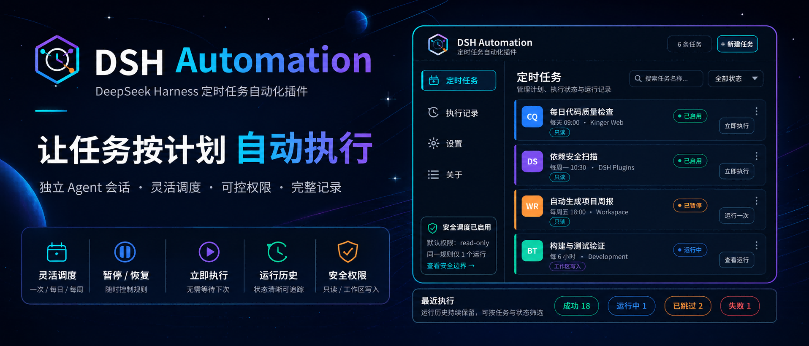
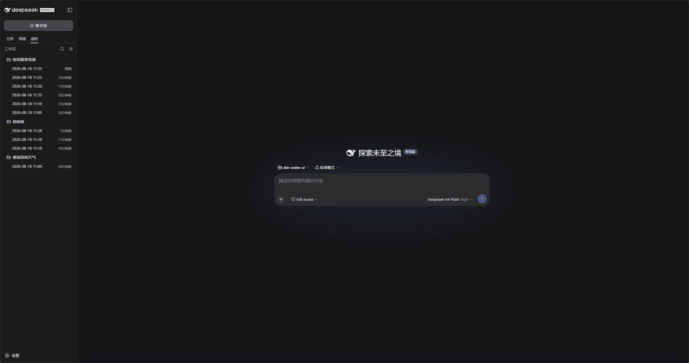
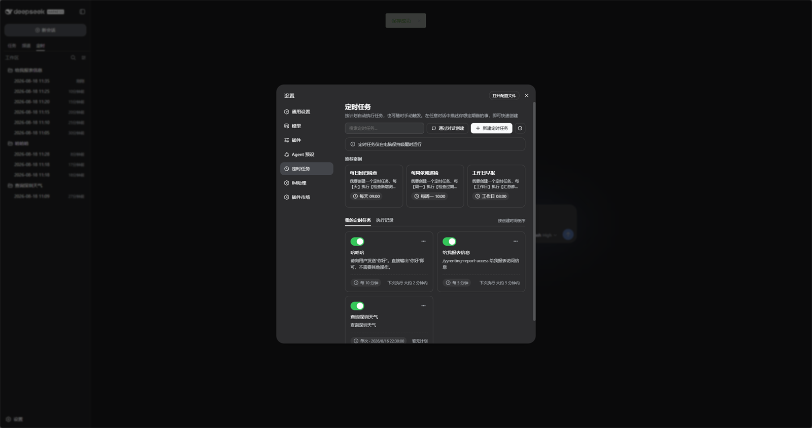
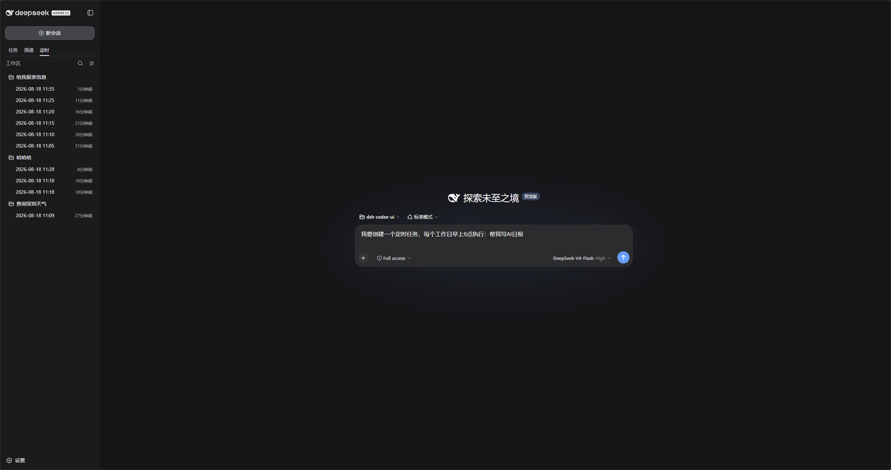
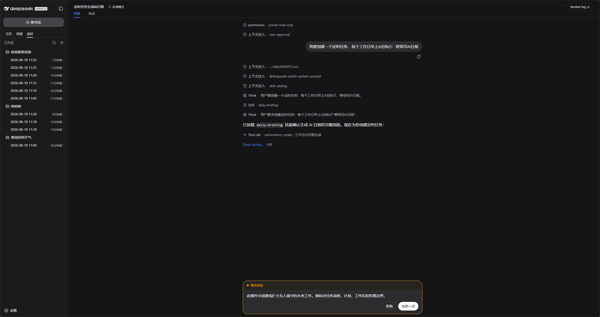
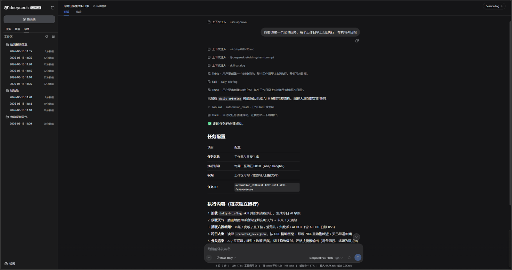
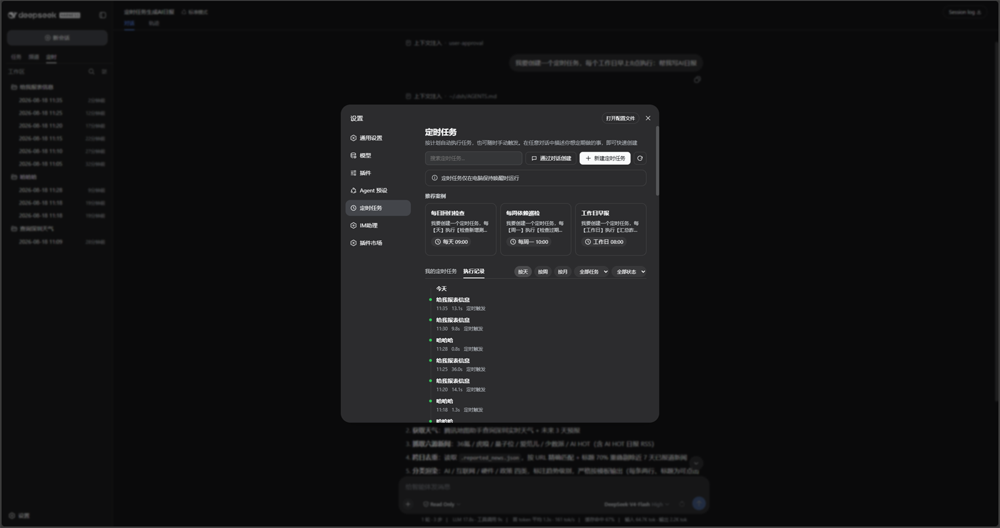

<p align="center">
  
</p>

<div align="center">

  # DSH Automation

  **在独立 DSH Session 中按计划执行编码任务**

  [English](README.md) · [Apache-2.0](LICENSE)

  [](LICENSE)
  [](https://www.npmjs.com/package/@michengai/dsh-automation)
  [](https://github.com/MichengAI/dsh-automation)
  [](https://nodejs.org/)
</div>

> DSH Automation 是社区维护的 DeepSeek Harness（DSH）插件，并非 DeepSeek AI 官方产品。

## 功能概览

- 在「设置 → 定时任务」里管理计划任务。
- 支持 Web 设置页和 Agent 工具创建、暂停、恢复、立即运行和删除。
- 每次到期都启动全新 root Agent 和 Session，不继承来源对话。
- 计划类型包括不重复、间隔、每小时、每天、每周、每月和自定义间隔天数。
- 新建弹窗可选择工作目录、模型、技能，以及 `read-only` / `workspace-write`。
- 在任意对话里描述定时任务即可创建；Full access 直接执行，其他权限走官方授权卡。
- 运行状态包含 `queued`、`running`、`succeeded`、`failed`、`skipped`、`cancelled`。
- 侧栏提供「定时」页签：文件夹是任务名称，子会话是执行时间。原生下只包裹官方任务树，不依赖 `dsh-codex-ui`。

## 界面预览

工作区左侧「任务 / 频道 / 定时」分列。定时任务只出现在「定时」：



打开「设置 → 定时任务」可搜索、新建、暂停和查看规则：



在对话里描述任务。Agent 会调用 `automation_create`，并弹出官方授权：





确认后规则会保存，并在对话里汇总：



执行记录留在设置页，可按天、周、月、任务或状态筛选：



## 前置条件

- 已可正常运行 DeepSeek Harness Web，且可在 PowerShell 中使用 `dsh`。
- 以下示例使用 `web` profile；请替换为实际目标 profile。
- 从源码安装或二次开发需要 Node.js 22.19+；仅从 npm 安装无需在任意目录执行 `npm install`。

## 安装

`dsh plugin add` 会转发到 profile 目录里的 `pnpm add`。不写版本、不指定官方源时，本机镜像可能让你停在旧版。

### 从 npm 安装

```powershell
[Console]::OutputEncoding = [System.Text.Encoding]::UTF8
$OutputEncoding = [System.Text.Encoding]::UTF8
dsh plugin --profile web add @michengai/dsh-automation@latest --registry=https://registry.npmjs.org/
dsh --profile web --dump-config
```

安装后重启 DSH Web，并在浏览器硬刷新。需要钉死某一版时，把 `@latest` 换成 `@0.1.3`。

### 从源码安装

适用于调试或使用未发布改动。克隆后的目录会直接作为插件安装路径：

```powershell
[Console]::OutputEncoding = [System.Text.Encoding]::UTF8
$OutputEncoding = [System.Text.Encoding]::UTF8
Set-Location D:\Repository\deepseek-harness-plugin
git clone https://github.com/MichengAI/dsh-automation.git
Set-Location .\dsh-automation
pnpm install
pnpm test
pnpm build
dsh plugin --profile web add .
dsh --profile web --dump-config
```

完成后重启 DSH Web 并硬刷新浏览器。`dsh plugin ... add .` 会自动读取并应用 `cordis.patch.yml`；不要手工复制 `lib` 文件。

## 使用

打开「设置 → 定时任务」，再按下表操作：

| 目标 | 操作 | 范围 |
| --- | --- | --- |
| 创建规则 | 点击「新建定时任务」，填写名称、计划、任务说明、工作目录、模型、技能和权限。 | 当前 Host |
| 通过对话创建 | 在任意对话描述定时任务，或点击「通过对话创建」。 | 当前对话 |
| 暂停或恢复 | 使用任务卡片上的开关。 | 单条规则 |
| 立即运行 | 打开卡片菜单，选择「立即执行」。 | 单条规则 |
| 删除 | 打开卡片菜单，选择「删除任务」。运行历史会保留。 | 仅定义 |
| 查看记录 | 打开「执行记录」，再按天、周、月、任务或状态筛选。 | 当前 Host |

每次派发都使用保存的任务说明、工作区、模型和权限边界，不会复用来源对话中的批准。

## 权限与安全边界

| 项目 | 行为 |
| --- | --- |
| 权限 | 默认 `read-only`。改文件必须显式选择 `workspace-write`。 |
| 完全访问 | 不提供无人值守 `danger-full-access`。 |
| 审批 | 对话创建跟随当前会话策略。Full access（`never`）直接创建；Workspace Write / Read Only（`ask`）走官方授权卡。无人值守运行仍是 fail-closed 的 `never`。 |
| 重试 | 已经开始的运行不会自动重试。 |
| Host 重启 | 遗留的 `queued` / `running` 会变成 `failed(host_interrupted)`。 |
| 重叠 | 同一规则同时最多一个 active run。冲突 occurrence 记为 `skipped(overlap)`。 |

计划只表达未来意图，不是缓存下来的授权。

## 二次开发

当前源码在 `src`，构建产物在 `lib`：

- [src\index.ts](src/index.ts)：Host 插件、工具和 RPC。
- [src\service.ts](src/service.ts)：持久化定义、时钟和运行准入。
- [src\client\index.ts](src/client/index.ts)：设置页和对话预填。
- `tests\*.test.ts`：领域、周期、服务、客户端和包契约测试。

修改后运行测试、重新构建，并以本地目录安装验证：

```powershell
[Console]::OutputEncoding = [System.Text.Encoding]::UTF8
$OutputEncoding = [System.Text.Encoding]::UTF8
pnpm check
dsh plugin --profile web add .
```

修改执行逻辑时必须保留 at-most-once 派发、Agent 工具的工作区边界，以及无人值守 fail-closed 审批。

## 验证

```powershell
[Console]::OutputEncoding = [System.Text.Encoding]::UTF8
$OutputEncoding = [System.Text.Encoding]::UTF8
pnpm test
pnpm build
```

`pnpm check` 会连续执行类型检查、测试和构建。

## 项目文档与许可证

项目状态、使用边界、技术架构和迭代记录从[文档交接入口](docs/00-交接入口/00-阅读导航.md)开始。补充说明见 NOTICE。

本项目采用 [Apache License 2.0](LICENSE)。